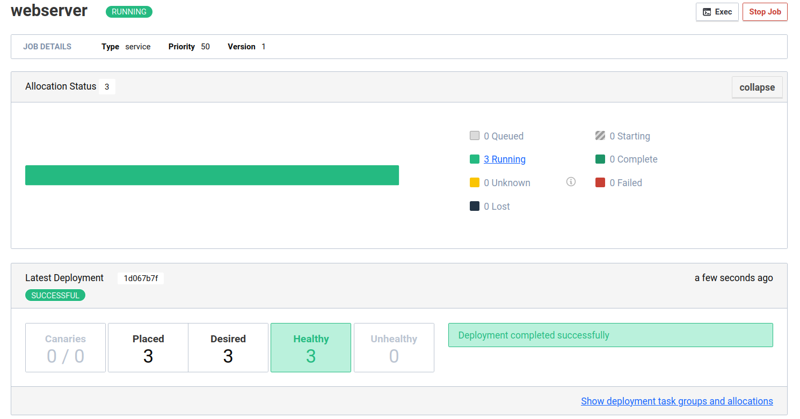
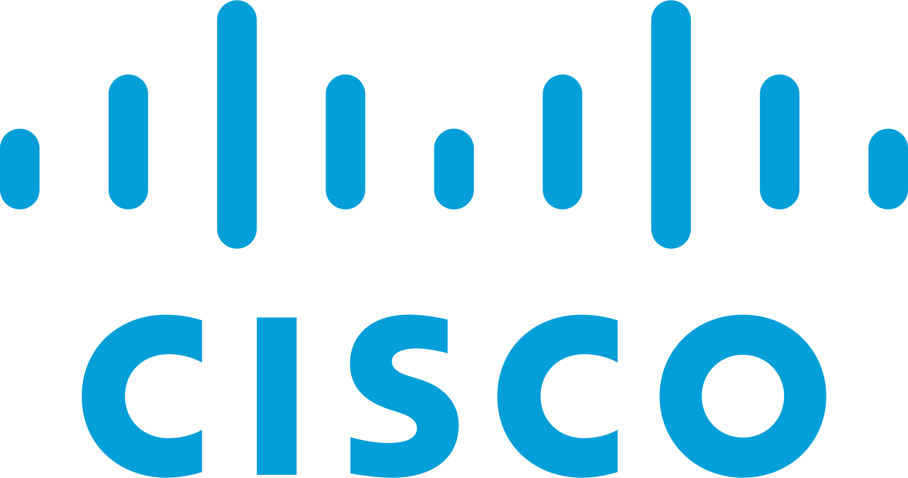
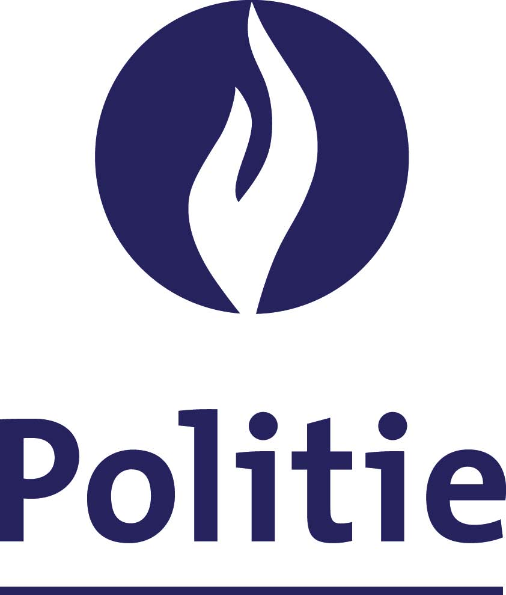

# Quality Engineering


**Gegeven door**: Capgemini
**Datum**: 7/03/2023
**Locatie**: Hogeschool PXL
## Inhoud
Het seminarie van Capgemini ging over quality engineering binnen de SDLC (Software Development Lifecycle). De inhoud van de seminarie was gefocust op waarom quality engineering noodzakelijk is, hoe het mogelijk moet zijn om slechte quality deliverance te vermijden.


# Forensics


**Gegeven door**: PWC
**Datum**: 21/03/2023
**Locatie**: Hogeschool PXL

## Inhoud
Door middel van een VM die kwam met een aantal tools voor forensics toe doen. Hier zagen we bijvoorbeeld een programma "jiggly mouse" wat verdacht was.


# Multi-cloud


**Gegeven door**: Gluo
**Datum**: 18/04/2023
**Locatie**: Hogeschool PXL

## inhoud
Dit seminarie stond in teken van het de verschillende manieren om een applicatie op te zetten en de infrastructuur te beheren. Van het manueel opzetten van een docker iamage tot het automatisch deployen van een multi-cloud setup. Zo konden we de lessen automatisatie eens in de praktijk zien.


# Nomad


**Gegeven door**: Inuits
**Datum**: 09/05/2023
**Locatie**: Hogeschool PXL
**Extra informatie**:
- github link: https://github.com/visibilityspots/workshops-infrastructure
- page link: https://visibilityspots.org/

## inhoud
Deze seminarie, gegeven door Inuits, ging over de container orchestrator Nomad.  
Nomad is een alternatief of extensie voor kubernetes. Het kan ingezet worden om containerized of legacy applicaties te deployen en beheren.  
Nomad wil het beheren en opzetten van clusters makkelijk maken. Hierdoor is het minder uitgebreid dan de wel bekende kubernetes orchestrator.  

een kleine vergelijking tussen nomad en kubernetes:
| feature  | Kubernetes  | Nomad  |
|---|---|---|
| use case  | container orchestration op grote schaal  | general-purpose orchestrator voor diverse workloads  |
| community  | groot  | groeiend, kleiner als kubernetes  |
| complexiteit  | Heel complex om mee te beginnen  | Makkelijker te leren.  |

Eerst leerden we een paar commando's om logs op te vragen en het ip van een hostname te vinden.

```bash
# Geeft logs van laatste 5 min
journalctl --since "5m ago"

# geeft ip terug
dig +short pxl-nomad8.workshop.inuits.dev
> 167.90.226.122
```

Nomad heeft 3 open poorten nodig om te werken. 3 voor de server (4646-4648) en 2 voor de clients (4647-4648).
De server poort is nodig om de API op te hosten. Deze kan de user gebruiken om met de nomad cluster te praten en commando's uit te voeren. Poort 4647 gebruiken de client agents om met elkaar en de servers te praten.

Binnen nomad heb je servers en clients. Servers zijn verantwoordelijk voor het accepteren van jobs, managen van clients en de jobs plaatsen op een client.  
Clients daarintegen zijn verantwoordelijk voor het uitvoeren van de jobs. Dit zelfde systeem wordt door kubernetes ook gebruikt.  
Een job binnen Nomad wordt gezien als een container die je opstart.

Vervolgens kregen we uitleg hoe je via de cli commands aan je nomad installatie kunt geven.

```bash
consul members
nomad server members

nomad status
nomad job status example
```

Met deze commands kun je je hosts bekijken en welke jobs op je cluster draaien. Dit geeft wat basis informatie over de hosts zoals address, status en de rol. De rol geeft aan of dit een "leader" is of niet.
`nomad status` geeft je de status van de "jobs" die op de cluster draaien en de status daarvan. Hier zie je dan ook hoe


We hebben hierna een aantal opdrachten gekregen om op een Nomad instance uit te voeren. Iedereen moest per 2 op een eigen nomad instance werken die tijdenlijk werd opgezet voor deze seminarie.
Dit begon met het aantal instances van een webserver te verhogen van 1 naar 3. Deze job wordt dan op meerdere clients, indien mogenlijk, uitgevoer en kan zo meer traffic aan en blijft ook werken als die client uitvalt. Dit is nuttig voor jobs die veel bezocht worden of niet mogen uitvallen.



Hierna hebben we geleerd dat je bij de metadata van een job kunt specifieren op welke client deze moet runnen. Anders zal deze bij elke boot een andere toegewezen krijgen.
Dit kan soms handig zijn als een specifieke job op een client moet runnen die toegang heeft tot een bepaald netwerk of resources. Denk aan zwaardere calculaties die best op een GPU plaatsvinden. Of een host die is aangesloten op een antenne die je gebruikt om vluchten bij te houden.

Na een aantal opdrachten rond jobs hebben we de tool `grafana` bekeken. Deze wordt gebruikt voor dashboards met allerlei informatie over de Nomad installatie en jobs.  
Dit is handig om de health en workload van de clients in de gaten te houden.

Verder hebben we nog een voorbeeld van iemand zijn eigen nomad installatie gezien. Deze had tools geïnstalleerd zoals:
- vault
- traefik
- prometheus
- grafana
- renovate
- wander

Dit zijn allemaal tools om het beheer en gebruik van je cluster makkelijker te maken. met vault en traefik kun je "reverse proxy" opzetten en je "secrets" geheim houden.
met prometheus en grafana kun je de cluster monitoren.

renovate wordt gebruikt om een git repo als "single source of truth" te gebruiken. Met andere woorden zorgt dit ervoor dat na elke push naar een repo wat daar opstaat automatisch op de lcuster gezet wordt. En tenslotte Wander is een terminal interface om je nomad instance te beheren.


## reflectieverslag
De seminarie over Nomad was een verfrissende en leerzame ervaring. Nomad bood een nieuw perspectief op container orchestration dan de tools die we in de opleiding zien. Het is altijd nuttig om kennis te maken met alternatieve tools en opties, omdat dit ons helpt om een breder inzicht te krijgen in de technologieën die beschikbaar zijn in de markt.

Wat dit seminarie bijzonder maakte, was de hands-on benadering. Het is algemeen bekend dat de beste manier om een tool te leren en de mogelijkheden ervan te ontdekken het gebruiken van de tool is. Tijdens dit seminarie hadden we de kans om Nomad in actie te zien, wat ons hielp om de functionaliteiten en voordelen ervan beter te begrijpen. Het gebruik van Nomad in een live omgeving stelde ons in staat om de theorie in de praktijk te brengen en om te zien hoe de tool presteert en werkt. Dit maakt het makkelijk om de verschillen met bekende tools, zoals docker en kubernetes, te testen en ondervinden.

De seminarie was een waardevolle aanvulling op onze opleiding en heeft mij bewust gemaakt van de diverse mogelijkheden die verschillende container orchestration tools kunnen bieden. Het heeft mij aangemoedigd om verder te kijken dan de tools die we al kennen en om open te staan voor nieuwe technologieën en methoden in onze toekomstige projecten. Het is belangrijk binnen de IT wereld om niet alleen te gebruiken waar je kennis van hebt maar om open te staan voor andere oplossingen.


# Meraki (Cloud) + converged (Cloud + on prem)


**Gegeven door**: Cisco
**Datum**: 08/11/2023
**Locatie**: Hogeschool PXL

## inhoud
Hier kregen we eerst wat uitleg over het Meraki platform van cisco waar we daarna mee aan de slag mochten. We kregen een aantal oefeingen met de API en met de website om zo verschillende aspecten in te stellen en op te vragen.


# Cyber security operations in the real world


**Gegeven door**: Secwise
**Datum**: 06/12/2023
**Locatie**: Hogeschool PXL

## inhoud
Hier hebben we wat `blue team` uitleg en een blik in de wereld van incident response gekregen. We kregen te zien hoe een security incident onderzocht werd en hoe dit in de toekomst vermeden kon worden.


# SAP: AI en process automation


**Gegeven door**: TheValueChain
**Datum**: 13/12/2023
**Locatie**: Hogeschool PXL

## inhoud
Seminarie over SAP en process automation. SAP is een resource planning software pakket wat bedrijven helpt op efficienter te werken. Hier kregen we uitleg over en enkele voorbeelden van oplossingen die ze gevonden hebben voor klanten.


# Digital forensics


**Gegeven door**: Politie
**Datum**: 10/01/2024
**Locatie**: Hogeschool PXL

## inhoud
In deze seminarie hebben we geleerd hoe de politie te werk gaat bij een digitale analyse van een systeem.  
Dit process gebeurt in 3 stappen:
- acquisition: Halen van de digitale media.
- analyse: Heeft 3 categorieen
    - identificatie: Waar zijn er artifacts
    - analyse: File systeem bekijken
    - Interpretatie
- Presentatie: De resultaten delen.

Voor we beginnen met de analyse moet de inhoud van de harde schijf gecloned worden. Je mag nooit op de drive zelf werken. Dan kun je achteraf de vraag krijgen, heb je dat zelf niet op de drive gezet? Er wordt gebruik gemaakt van hashes om te controleren dat er niks is veranderd op de originele schijf.
Om dit te voorkomen wordt de drive ook best met een `writeblocker` op zowel hard als software niveau uitgevoerd. Zo kun je nooit perongeluk iets naar de drive toeschrijven en het onderzoek beinvloeden. Verder is het ook niet handig dat als de schijf nog 400GB vrije opslag heeft om dit mee te kopieren. Tools zoals dd geven de optie om alleen de data te kopieren en niet de lege plekken.

Eerst hebben we wat commando's geleerd om informatie over een drive te verkrijgen.
```bash
lsusb -v | grep -i -a3 kingston
hdparm /dev/sda
lsblk
lssci # Geeft meer info over de gebruikte drive, niet de partities.

# ls in een disk
fls -o 1026048 /dev/sdb
```

Hierna wat oefeningen met een usb stick (of vhd in virtualbox).
Via fdisk hier partities opgemaakt. Hierna een bestandje op de drive aangemaakt en deze weer verwijderd. Bestanden die je verwijdert worden niet echt verwijderd. Je schijf zet deze ruimte gewoon als 'beschikbaar' en als je nog een bestandje aanmaakt kan deze over de vorige worden heen geschreven. Het is dus mogenlijk om recent verwijderdere bestanden vaak helemaal intact terug te vinden of nog een groot deel hiervan.  
Het beste om dit tegen te gaan is de schijf `schredden`. Dit wil zeggen een patroon (meestal allemaal 0en) meerdere keren over heel de schijf te schrijven. 

Met tools zoals `fls`, `icat` en `tsk_recover` is het mogenlijk om recent verwijderde bestanden terug te halen.

loop devices worden gebruikt als je geen open partities meer hebt maar toch partities wilt gebruiken. Je kunt zo een `file` aanmaken en dan een loop device met deze file.

Hierna hebben we geleerd hoe je foto's kunt onderzoeken met `file` en `display`. Hierna hebben we verborgen texten uit de foto's gehaald. Fijn om weer even de security lessen op te frissen.
