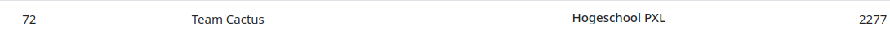
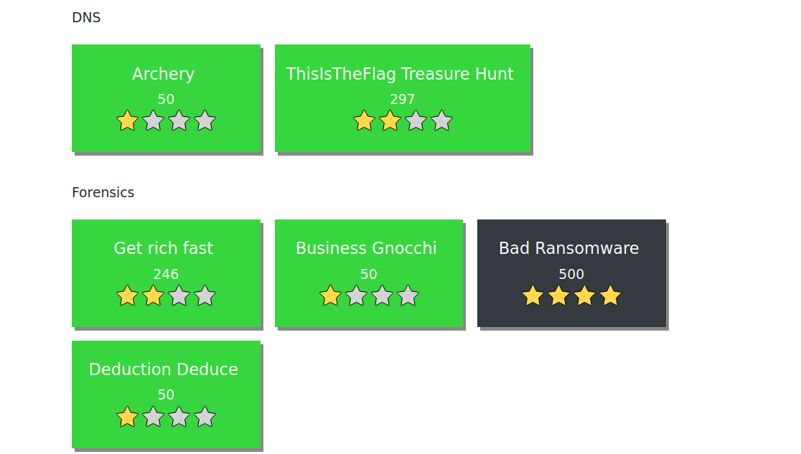
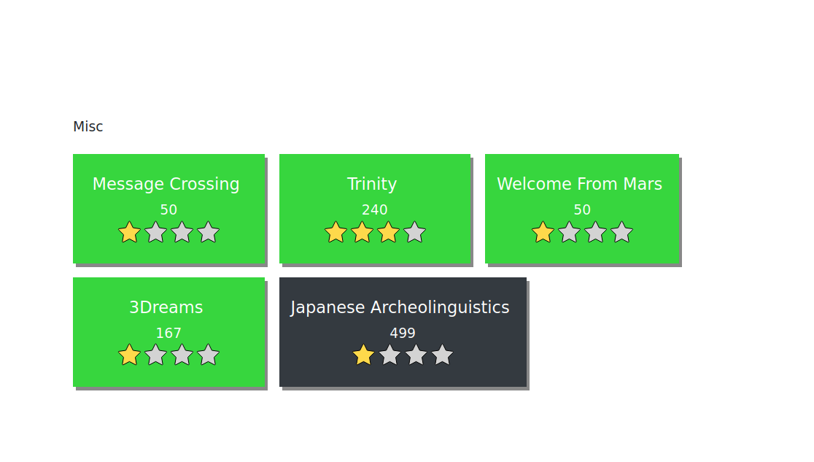
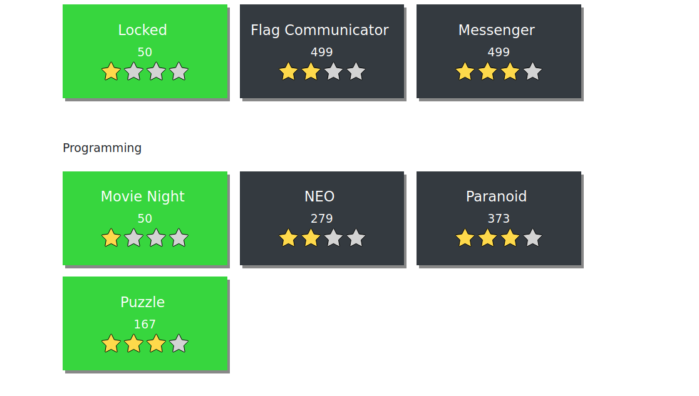
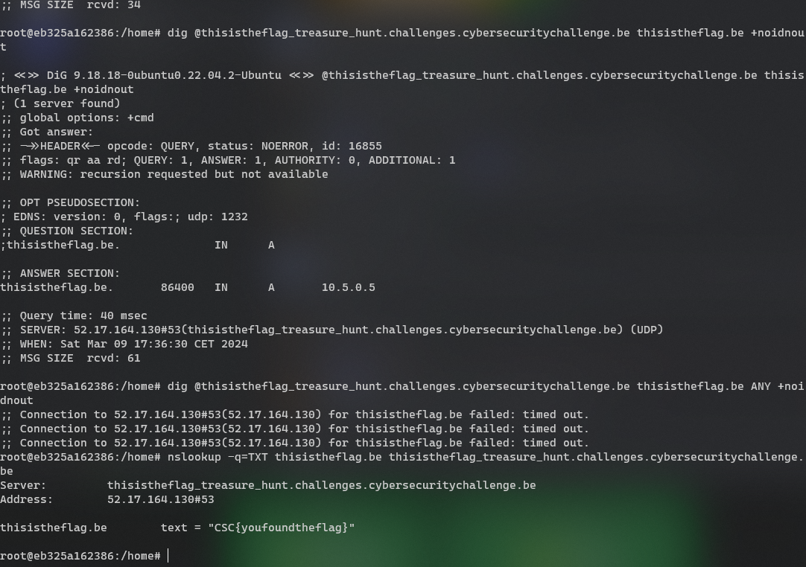
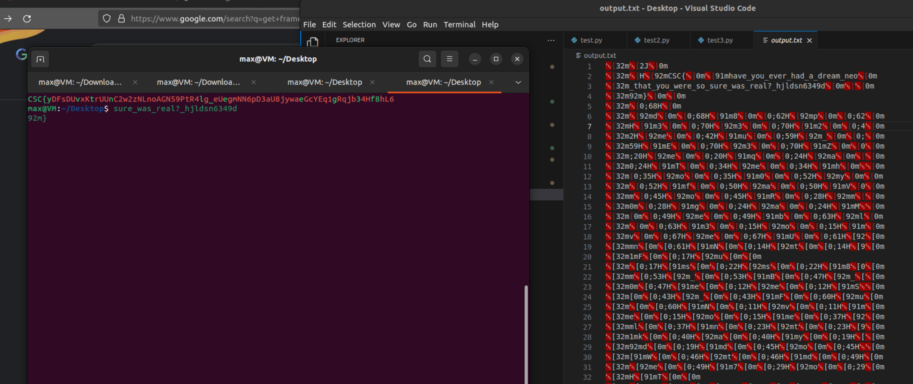
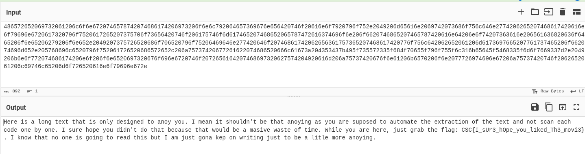
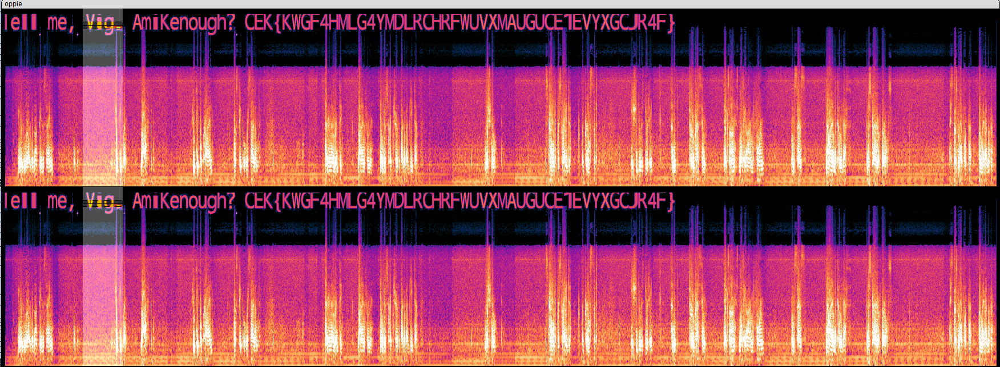

# innovatieroute
Voor de innovatieroute heb ik gekozen voor `Security & Cloud`. Dit leek me de meest interesante voor mijn opleiding.

## Unleash Your Cybersecurity Potential: From Zero Trust to SASE Mastery
Exclusive Networks / Fortinet
28/09/2023 - Hogeschool PXL

### inhoud
Seminarie over cyber security en fortinet. Eerst algemene uitleg over cyber security en best pracktices. Hierna informatie over de implementaties en services die Fortinet heeft te bieden.

## Penatration Testing
The Security Factory
05/10/2023 - Hogeschool PXL

### inhoud
Seminarie over Ethical hacking. Eerst de theoretische uitleg over de meest voorkomende problemen. Hierna gebruik gemaakt van `burp suite` en `kali linux` om deze scebario's uit te testen.

## DevSecOps
Gluo
12/10/2023 - Hogeschool PXL

### inhoud
Workshop over DevSecOps. Hier moesten we een webite op een cluster zetten met gebruik van een aantal tools:
- Gitlab
- Terraform
- Docker
- Kubernetes
- helm

# Hackathons
Voor de opleiding heb ik 2x meegedaan aan de CSCNE (Cyber Security Challenge Belgium).  
Ik ga het hier vooral hebben over mijn 2de poging.

Voor deze hackathon die van 08/03-10:00 tot 09/03-18:00 liep heb ik samengewerkt met 3 teamgenoten van de opleidingen SNB en AON.  
uiteindelijk zijn we geeindigd op plaats 72 van de 211 die actief hebben deelgenomen.  
We hebben geen taakverdeling gemaakt, maar gingen gewoon samen of apart aan een challenge werken en vroegen anderen om hulp of een andere blik.



Om hier te geraken hebben we opdrachten van allemaal verschillende diciplines moeten oplossen.  
Oefeningen over DNS, forensics, programming en nog wat misc zaten er allemaal bij. Deze waren dan onderverdeeld in een moeilijkheidsgraad. We hebben geprobeerd om bij de meeste toch zeker 1 van de moeilijkere oefeningen te halen.





De leukste hieruit waren in mijn ogen de DNS, programming en van Misc de Trinity opdrachten.

## DNS challenges

Bij de DNS opdrachten moest je via commando's zoals `dig` en `nslookup` een flag uit een DNS record halen.
De eerste kreeg je als je met nslookup een string in de txt recods terug waarin stond "kom binnen 'ip address' time terug voor de flag".
Hier moest je dus op een specifieke timing om de records vragen. Dit werkte uiteindelijk niet helemaal omdat sommige DNS providers later pas updaten.
uiteindelijk kon je dus de flag krijgen door zoveel mogenlijk DNS providers te querien en te kijken of een de juiste records nog had.

Bij de 2de opdracht moesten we een flag halen via een specifieke DNS providers voor een website. Dit is uiteindelijk gelukt met het dig commando.


## Programming challenges

Hier heb ik 3 challenges van geprobeerd en 2 van opgelost. De NEO challenge was net niet gelost maar was dichtbij toen ik mijn oplossing vergeleek met de write ups.



De eerste opdracht kreeg je een zip met 445 foto's van QR codes. ALs je deze scande kreeg je altijd 2 characters terug, eg `48`, `65`, ...
Uiteindelijk deze met een tool achter elkaar gezet in een gif en deze dan weer frame per frame ingelezen. Zo kwam je een lange string terug met `HEX` waardes.
Deze kun je met online tools zoals `cyberchef` terug in ascii omzetten.



De 2de programming challenge moest je een verbinding maken met een server en kreeg je een matrix terug die je dan op volgorde moest terugzeten.
Een mogenlijke puzzle zag er zo uit:
```
+---+---+---+
| 3 | 5 | 9 |
+---+---+---+
| 2 | 1 | 6 |
+---+---+---+
| 4 | 7 | 8 |
+---+---+---+
```
En deze moest dan weer op volgorde gezet worden, van 1-9, door commando's mee te geven. Je gaf een string door `rdbulbdbwrb` om bijvoorbeeld de 1 en 2 al goed te zetten.
uiteindelijk kon je deze moves doen:
```
'l': 'left',
'r': 'right',
'u': 'up',
'd': 'down',
'b': 'buffer'
```

De volgende matrix gaf bijvoorbeeld volgende oplossing:
```
+----+----+----+----+
| 11 |  5 | 15 |  4 |
+----+----+----+----+
|  3 | 12 |  6 |  1 |
+----+----+----+----+
| 14 |  7 | 10 | 13 |
+----+----+----+----+
|  8 |  9 |  2 | 16 |
+----+----+----+----+

oplossing: rrrdblllubrrdddbluuubldbrrubdblbdbrubllddbrrruubllddblubrrblbrdbubdbrubllldbrrblb
```

De puzzle was elke keer anders en varieerde van een 4x4 tot een 9x9.

## trinity
Ten slotte had je nog de opdracht trinity. Dit was een video die je kon bekijken op een s3 bucket. Toen we achteraf de video via diverse tools hadden bekeken op verborgen materiaal in het beeld besloten we naar het geluid te kijken. Uiteindelijk kwamen we zo een verborgen bericht tegen.



Na verder onderzoeken bleek de vic een hint naar het algoritme dat gebruikt was om de flag te encrypteren. Met die kennis konden we dit terug omdraaien en de flag verkrijgen.

## reflectie

De hackathon is een goede manier om je `critical` en `out of the box` denken aan het werk te zetten. Vaak is niks wat het lijkt en moet je diepgaan om de flags te vinden. Het is heel fijn dat er zo een variatie is aan opdrachten omdat er zo voor iedereen wel iets is. Het waren fijne en stresvolle uren maar zou dit zo weer doen.

ik heb vooral geleerd om iets op te pakken en even vast te bijten. Ook zag ik de meerwaarde van soms even iemand door je denkwijze te laten redeneren omdat je soms iets duidelijks mist of soms heeft iemand een ander beeld. Maar soms is het goed om een opdracht even neer te leggen en hier later met een 'frissere' blik opnieuw naar te kijken. Ik had bijvoorbeeld een duidelijke edge case niet voorzien in mijn code en kon dit eers niet vinden. Achteraf toen ik terugkwam was dit allemaal opgelost binnen 5 minuten.

Dit was allemaal heel wat anders dan wat we in de lessen security gezien hebben. Maar toch kwam wel wat kennis van pas, zo wisten we al van een aantal tools voor steganography en wat basis voor het bekijken van de websites. Deze konden we dan eens in de praktijk uitproberen en oefenen. Ik heb hier veel geleerd over kritisch denken en niet te snel opgeven om iets anders te proberen. Vaak denk je 'het lukt niet, dus probeer een andere'. Maar dat kun je natuurlijk niet blijven doen. Ook helpen de programmeer lessen, voornamelijk IT-essentials, en linux essenttials en advanced hierbij. Wat scripting en kennis van basic CLI is wel een must hiervoor.

Mijn sterke punten hier waren mijn verleden met programming challenges zoals `advent of code`. Dit helpt bij het logisch opstellen van een oplossing voor de programming challenges.