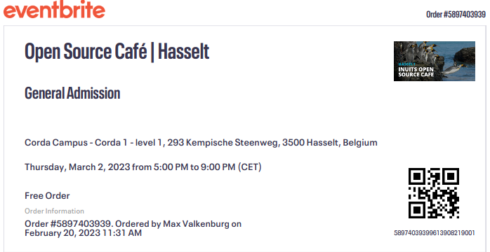
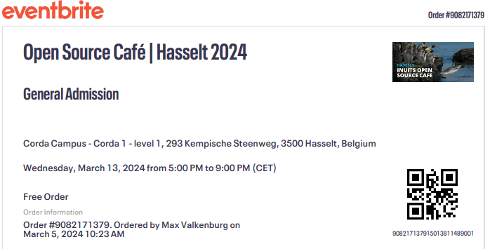

# projectweek
13/02/2023 - 17/02/2023 - Hogeschool PXL

## inhoud
De projectweek was een week aan verschillende activiteiten en seminaries om jezelf en je team gennoten beter te leren kennen. Dit hielp dan om de samenwerking te verbeteren.

# POP-sessies
Voor de opleiding hebben we deelgenomen aan 3 verschillende POP-sessies. Deze waren bedoeld om jezelf en je groep beter te leren kennen om zo de samenwerking beter te laten verlopen.

## POPping
28/02/2023 - Hogeschool PXL

### inhoud
Verschillende sterke en zwakke punten van je collega's leren kennen. Ook leren omgaan met geven en ontvangen van feedback. Hierna hebben we een persoonlijk ontwikkelingsplan uitgewerkt.

## Brein aan het werk! Niet storen! 
28/02/2023 - Hogeschool PXL

### inhoud
Tijders deze sessie werd er onderzocht hoe afhankelijk we waren van onze smartphone met behulp van een experiment. Hier hebben we dan interesante gegevens over ons smartphone gebruik uit kunnen halen.

## My team and I
11/10/2023 - Hogeschool PXL

### inhoud
Dit was een sessie over hoe de dynamiek in een team alles kan beinvloeden. Hoe je het beste met problemen omgaat en met elkaar communiceert. We kregen een aantal oefeningen om te kijken wie wat het belangrijkste vondt binnen een het team.

# open source cafe
**Gegeven door**: Inuits
**Datum**: 02/03/2023 & 13/03/2024
**Locatie**: Corda 1 - verdieping 1
**Extra informatie**:
- zelf aangebracht

## inhoud
 

2x naar het open source cafe van Inuits gegaan. Hier lieten ze zien hoe en wat ze in hun eigen homelab hadden draaien. verder kregen we uitleg over AI en wat Inuits hier allemaal mee doet.
