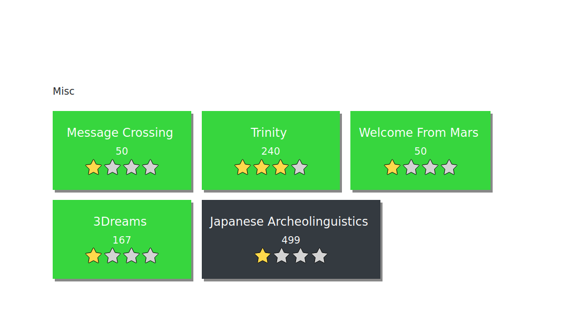
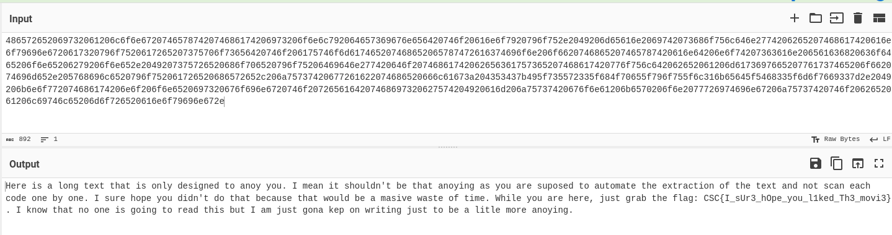

# studentenvereniging
**Datum**: 09/2021 - huidig
**Domein**: Persoonlijke ontwikkeling
**Extra informatie**:
- Zelf aangebracht.

## inhoud
Mijn groei en ervaring was verrijkt door mijn betrokkenheid bij studentenvereniging Hexion. Dit is de studentenvereniging van de DIGITAL-afdeling van PXL. Ik ben al drie jaar lid van deze vereniging, een periode die gekenmerkt wordt door groei, leiderschap en vriendschap. Van deze 3 jaar ben ik 2 jaar leidend lid geweest, eerst als schachtenmeester en dit jaar als vice-preaes.
 
In mijn tweede jaar bij Hexion nam ik de rol van “schachtenmeester” op me. Deze positie gaf me de verantwoordelijkheid om nieuwe leden te ondersteunen en te begeleiden. Dit niet alleen binnen het studentenleven maar ook binnen de studie. Aanmoedigen om naar de lessen te gaan en ondersteunen bij vragen zaten hier allemaal bij. Verder was ik ook verantwoordelijk voor het organiseren van de doop. Aangezien dit een van de belangrijkste evenementen van het jaar en ook de eerste is, was dit een grote verantwoordelijkheid. Dit heeft me geholpen met heb besef dat je niet bang moet zijn als je iets niet weet, maar gewoon om hulp moet vragen.

Na mijn tijd als schachtenmeester, heb ik een jaar doorgebracht als “vice-praeses”. In deze rol ondersteunde ik de “praeses” met de dagelijkse taken en hielp ik andere “praesidia” leden waar nodig. Hier had ik de kans om kennis en ervaring op te doen over het leiden van een groep. Verder heb ik hier geleerd omgaan met verantwoordelijkheden en punctueel zijn. Dit hielp me bij de verschillende projecten binnen de opleiding aangezien ik zo al extra ervaring had. Dit hielp mij bij het omgaan van de verschillende problemen die wel eens voorkomen binnen zo een project. 

Binnen Hexion was ik ook betrokken bij het organiseren van feestjes en andere studentikoze activiteiten. Deze evenementen waren niet alleen een kans voor leden om te ontspannen en plezier te hebben, maar ook om banden te smeden en een sterk gevoel van samenhorigheid te creëren. Ik hielp mee aan de planning, coördinatie en zorgde ervoor dat alles soepel verliep. Ook hier heb ik geleerd rustig te blijven bij stressvolle situaties en omgaan met last minute veranderingen.

Maar onze inspanningen gingen verder dan alleen plezier. We organiseerden ook een “blokbar” tijdens elke examenperiode. Dit was een ruimte waar studenten samen konden studeren en elkaar hulp konden aanbieden. Dit was ook niet alleen beschikbaar voor onze leden maar werd ook gepromoot op verschillende plaatsen als een open studie plek voor iedereen.

Als leidend lid word ik ook uitgenodigd voor de academische openingszitting. Hier heb ik kunnen netwerken met verschillende mensen uit de academische wereld en de studentenverenigingen kunnen vertegenwoordigen.

Als lid van een studentenvereniging wordt er soms ook verwacht dat je helpt op de verschillende evenementen die de PXL aanbiedt. In het beginvan het jaar proberen we nieuwe leden aan te werven. Hiervoor staan wij jaarlijks aan de ingang van het B en G gebouw. Maar hier zijn wij ook een makkelijk aanspreekpunt voor nieuwe studenten die de weg nog aan het zoeken zijn naar hun lokaal of de nodige diensten van PXL.  
## reflectieverslag
 Zoals in het begin van deze showcase al vermeld is, was dit een periode die gekenmerkt wordt door groei, leiderschap en vriendschap. Maar ik heb hier veel meer geleerd dan alleen dit. Ik ben hier sterker geworden in het samenwerken binnen een team. Ook had ik hier contact met mensen van de opleiding die ik anders nooit ontmoet had en zo hun ervaringen ook kunnen horen. 

 

Ik heb hier vaker te maken gehad met situaties waar meerdere mensen een andere mening hadden over hoe iets opgelost moet worden. Dit heeft me geholpen binnen de opleiding bij diverse projecten waar dit ook vaker voorkomt. Verder moesten bepaalde zaken tijdig in orde gemaakt worden en dit helpt bij het bevorderen van de discipline. Mijn doelgerichte mindset zorgde er hier vaak voor dat we minder tijd verloren bij onbelangrijke zaken. 

 

Verder heb ik hier de kennis van de POP-sessies kunnen toepassen van het geven en ontvangen van kritiek. Soms was ik wel eens iets vergeten of ergens te laat mee en dan werd dit medegedeeld. Hier heb ik geleerd daar constructief mee om te gaan en hier de positieve en verbeter punten uit te halen. 

 

Ik heb deze activiteit gekozen omdat dit een belangrijk deel in mijn leven is geworden. Ik heb hier weinig vakkennis opgedaan. Maar wel veel vernieuwde blikken op problemen en veel soft skills bijgeleerd. Ook heb ik hier kunnen netwerken met andere mensen binnen en buiten het DIGITAL departement.


# Seminarie: Nomad


**Gegeven door**: Inuits
**Datum**: 09/05/2023
**Locatie**: Hogeschool PXL
**Extra informatie**:
- github link: https://github.com/visibilityspots/workshops-infrastructure
- page link: https://visibilityspots.org/

## inhoud
Deze seminarie, gegeven door Inuits, ging over de container orchestrator Nomad.  
Nomad is een alternatief of extensie voor kubernetes. Het kan ingezet worden om containerized of legacy applicaties te deployen en beheren.  
Nomad wil het beheren en opzetten van clusters makkelijk maken. Hierdoor is het minder uitgebreid dan de wel bekende kubernetes orchestrator.  

Een kleine vergelijking tussen nomad en kubernetes:
| feature  | Kubernetes  | Nomad  |
|---|---|---|
| use case | container orchestration op grote schaal | general-purpose orchestrator voor diverse workloads  |
| community | groot | groeiend, kleiner als kubernetes |
| complexiteit | Heel complex om mee te beginnen | Makkelijker te leren. |

Eerst leerden we een paar commando's om logs op te vragen en het IP van een hostname te vinden.

```bash
# Geeft logs van laatste 5 min
journalctl --since "5m ago"

# geeft ip terug
dig +short pxl-nomad8.workshop.inuits.dev
> 167.90.226.122
```

Nomad heeft 3 open poorten nodig om te werken. 3 voor de server (4646-4648) en 2 voor de clients (4647-4648).
De server poort is nodig om de API op te hosten. Deze kan de user gebruiken om met de nomad cluster te praten en commando's uit te voeren. Poort 4647 gebruiken de client agents om met elkaar en de servers te praten.

Binnen nomad heb je servers en clients. Servers zijn verantwoordelijk voor het accepteren van jobs, managen van clients en de jobs plaatsen op een client.  
Clients daarintegen zijn verantwoordelijk voor het uitvoeren van de jobs. Ditzelfde systeem wordt door kubernetes ook gebruikt.  
Een job binnen Nomad wordt gezien als een container die je opstart.

Vervolgens kregen we uitleg hoe je via de cli commands aan je nomad installatie kunt geven.

```bash
consul members
nomad server members

nomad status
nomad job status example
```

Met deze commands kun je je hosts bekijken en welke jobs op je cluster draaien. Dit geeft wat basisinformatie over de hosts zoals address, status en de rol. De rol geeft aan of dit een "leader" is of niet.
`nomad status` geeft je de status van de "jobs" die op de cluster draaien en de status daarvan. Hier zie je dan ook hoe


We hebben hierna een aantal opdrachten gekregen om op een Nomad instance uit te voeren. Iedereen moest per 2 op een eigen nomad instance werken die tijdenlijk werd opgezet voor deze seminarie.
Dit begon met het aantal instances van een webserver te verhogen van 1 naar 3. Deze job wordt dan op meerdere clients, indien mogenlijk, uitgevoer en kan zo meer traffic aan en blijft ook werken als die client uitvalt. Dit is nuttig voor jobs die veel bezocht worden of niet mogen uitvallen.


Hierna hebben we geleerd dat je bij de metadata van een job kunt specifiëren op welke client deze moet runnen. Anders zal deze bij elke boot een andere toegewezen krijgen.
Dit kan soms handig zijn als een specifieke job op een client moet runnen die toegang heeft tot een bepaald netwerk of resources. Denk aan zwaardere calculaties die best op een GPU plaatsvinden. Of een host die is aangesloten op een antenne die je gebruikt om vluchten bij te houden.

Na een aantal opdrachten rond jobs hebben we de tool `grafana` bekeken. Deze wordt gebruikt voor dashboards met allerlei informatie over de Nomad installatie en jobs.  
Dit is handig om de health en workload van de clients in de gaten te houden.

Verder hebben we nog een voorbeeld van iemand zijn eigen nomad installatie gezien. Deze had tools geïnstalleerd zoals:
- vault
- traefik
- prometheus
- grafana
- renovate
- wander

Dit zijn allemaal tools om het beheer en gebruik van je cluster makkelijker te maken. Met vault en traefik kun je "reverse proxy" opzetten en je "secrets" geheimhouden.
met prometheus en grafana kun je de cluster monitoren.

Renovate wordt gebruikt om een git repo als "single source of truth" te gebruiken. Met andere woorden zorgt dit ervoor dat na elke push naar een repo wat daar opstaat automatisch op de cluster gezet wordt. En tenslotte Wander is een terminal interface om je nomad instance te beheren.


## reflectieverslag
Het seminarie over Nomad was een verfrissende en leerzame ervaring. Nomad bood een nieuw perspectief op container orchestration dan de tools die we in de opleiding zien. Het is altijd nuttig om kennis te maken met alternatieve tools en opties, omdat dit ons helpt om een breder inzicht te krijgen in de technologieën die beschikbaar zijn in de markt.

Wat dit seminarie bijzonder maakte, was de hands-on benadering. Het is algemeen bekend dat de beste manier om een tool te leren en de mogelijkheden ervan te ontdekken het gebruiken van de tool is. Tijdens dit seminarie hadden we de kans om Nomad in actie te zien, wat ons hielp om de functionaliteiten en voordelen ervan beter te begrijpen. Het gebruik van Nomad in een live omgeving stelde ons in staat om de theorie in de praktijk te brengen en om te zien hoe de tool presteert en werkt. Dit maakt het makkelijk om de verschillen met bekende tools, zoals docker en kubernetes, te testen en ondervinden.

De seminarie was een waardevolle aanvulling op onze opleiding en heeft mij bewust gemaakt van de diverse mogelijkheden die verschillende container orchestration tools kunnen bieden. Het heeft mij aangemoedigd om verder te kijken dan de tools die we al kennen en om open te staan voor nieuwe technologieën en methoden in onze toekomstige projecten. Het is belangrijk binnen de IT-wereld om niet alleen te gebruiken waar je kennis van hebt maar om open te staan voor andere oplossingen.


# Hackathons
Voor de opleiding heb ik 2x meegedaan aan de CSCNE (Cyber Security Challenge Belgium).  
Ik ga het hier vooral hebben over mijn 2de poging.

Voor deze hackathon die van 08/03-10:00 tot 09/03-18:00 liep heb ik samengewerkt met 3 teamgenoten van de opleidingen SNB en AON.  
Uiteindelijk zijn we geeindigd op plaats 72 van de 211 die actief hebben deelgenomen.  
We hebben geen taakverdeling gemaakt, maar gingen gewoon samen of apart aan een challenge werken en vroegen anderen om hulp of een andere blik.


Om hier te geraken hebben we opdrachten van allemaal verschillende diciplines moeten oplossen.  
Oefeningen over DNS, forensics, programming en nog wat misc zaten er allemaal bij. Deze waren dan onderverdeeld in een moeilijkheidsgraad. We hebben geprobeerd om bij de meeste toch zeker 1 van de moeilijkere oefeningen te halen.





De leukste hieruit waren in mijn ogen de DNS, programming en van Misc de Trinity opdrachten.

## DNS challenges

Bij de DNS opdrachten moest je via commando's zoals `dig` en `nslookup` een flag uit een DNS record halen.
De eerste kreeg je als je met nslookup een string in de txt recods terug waarin stond "kom binnen 'ip address' time terug voor de flag".
Hier moest je dus op een specifieke timing om de records vragen. Dit werkte uiteindelijk niet helemaal omdat sommige DNS providers later pas updaten.
Uiteindelijk kon je dus de flag krijgen door zoveel mogelijk  DNS providers te querien en te kijken of een de juiste records nog had.

Bij de 2de opdracht moesten we een flag halen via een specifieke DNS providers voor een website. Dit is uiteindelijk gelukt met het dig commando.


## Programming challenges

Hier heb ik 3 challenges van geprobeerd en 2 van opgelost. De NEO challenge was net niet gelost maar was dichtbij toen ik mijn oplossing vergeleek met de write ups.


De eerste opdracht kreeg je een zip met 445 foto's van QR codes. Als je deze scande kreeg je altijd 2 characters terug, eg `48`, `65`, ...
Uiteindelijk deze met een tool achter elkaar gezet in een gif en deze dan weer frame per frame ingelezen. Zo kwam je een lange string terug met `HEX` waardes.
Deze kun je met online tools zoals `cyberchef` terug in ascii omzetten.



De 2de programming challenge moest je een verbinding maken met een server en kreeg je een matrix terug die je dan op volgorde moest terugzetten.
Een mogelijke puzzle zag er zo uit:
```
+---+---+---+
| 3 | 5 | 9 |
+---+---+---+
| 2 | 1 | 6 |
+---+---+---+
| 4 | 7 | 8 |
+---+---+---+
```
En deze moest dan weer op volgorde gezet worden, van 1-9, door commando's mee te geven. Je gaf een string door `rdbulbdbwrb` om bijvoorbeeld de 1 en 2 al goed te zetten.
uiteindelijk kon je deze moves doen:
```
'l': 'left',
'r': 'right',
'u': 'up',
'd': 'down',
'b': 'buffer'
```

De volgende matrix gaf bijvoorbeeld volgende oplossing:
```
+----+----+----+----+
| 11 |  5 | 15 |  4 |
+----+----+----+----+
|  3 | 12 |  6 |  1 |
+----+----+----+----+
| 14 |  7 | 10 | 13 |
+----+----+----+----+
|  8 |  9 |  2 | 16 |
+----+----+----+----+

oplossing: rrrdblllubrrdddbluuubldbrrubdblbdbrubllddbrrruubllddblubrrblbrdbubdbrubllldbrrblb
```

De puzzle was elke keer anders en varieerde van een 4x4 tot een 9x9.

## trinity
Ten slotte had je nog de opdracht trinity. Dit was een video die je kon bekijken op een s3 bucket. Toen we achteraf de video via diverse tools hadden bekeken op verborgen materiaal in het beeld besloten we naar het geluid te kijken. Uiteindelijk kwamen we zo een verborgen bericht tegen.


Na verder onderzoeken bleek de vic een hint naar het algoritme dat gebruikt was om de flag te encrypteren. Met die kennis konden we dit terug omdraaien en de flag verkrijgen.

## reflectie

De hackathon is een goede manier om je `critical` en `out of the box` denken aan het werk te zetten. Vaak is niks wat het lijkt en moet je diepgaan om de flags te vinden. Het is heel fijn dat er zo een variatie is aan opdrachten omdat er zo voor iedereen wel iets is. Het waren fijne en stresvolle uren maar zou dit zo weer doen.

ik heb vooral geleerd om iets op te pakken en even vast te bijten. Ook zag ik de meerwaarde van soms even iemand door je denkwijze te laten redeneren omdat je soms iets duidelijks mist of soms heeft iemand een ander beeld. Maar soms is het goed om een opdracht even neer te leggen en hier later met een 'frissere' blik opnieuw naar te kijken. Ik had bijvoorbeeld een duidelijke edge case niet voorzien in mijn code en kon dit eers niet vinden. Achteraf toen ik terugkwam was dit allemaal opgelost binnen 5 minuten.

Dit was allemaal heel wat anders dan wat we in de lessen security gezien hebben. Maar toch kwam wel wat kennis van pas, zo wisten we al van een aantal tools voor steganography en wat basis voor het bekijken van de websites. Deze konden we dan eens in de praktijk uitproberen en oefenen. Ik heb hier veel geleerd over kritisch denken en niet te snel opgeven om iets anders te proberen. Vaak denk je 'het lukt niet, dus probeer een andere'. Maar dat kun je natuurlijk niet blijven doen. Ook helpen de programmeer lessen, voornamelijk IT-essentials, en linux essenttials en advanced hierbij. Wat scripting en kennis van basic CLI is wel een must hiervoor.

Mijn sterke punten hier waren mijn verleden met programming challenges zoals `advent of code`. Dit helpt bij het logisch opstellen van een oplossing voor de programming challenges.